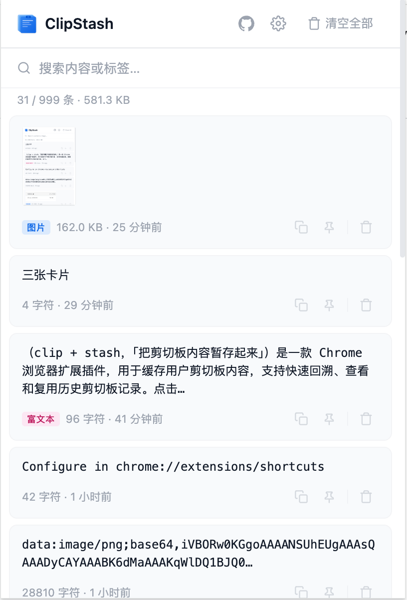
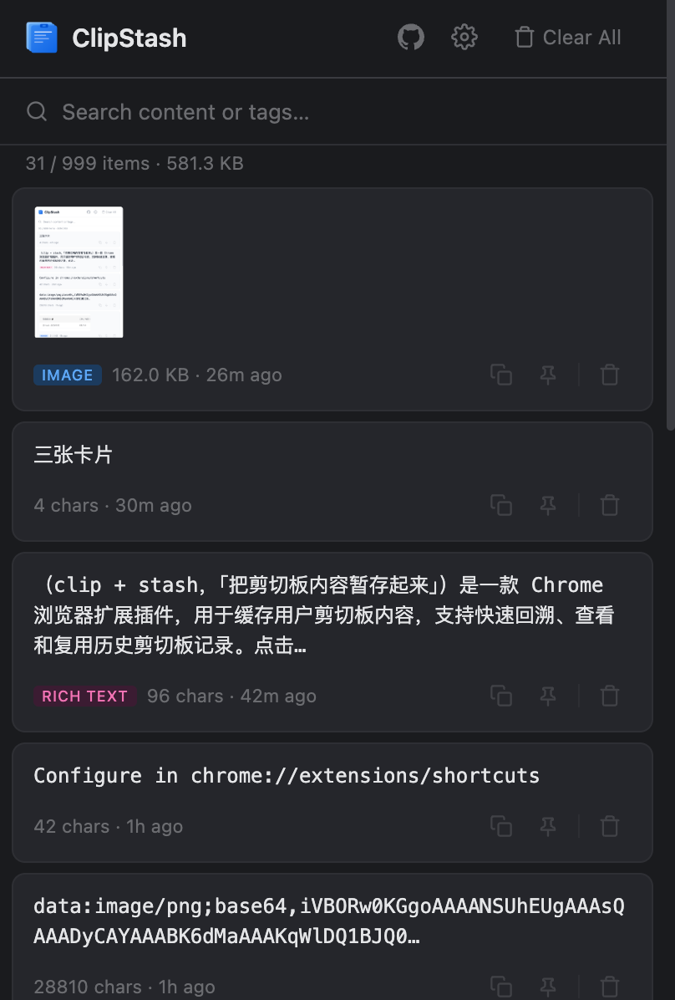

# ClipStash

Chrome 剪切板缓存插件 — 一键暂存剪切板内容，随时回溯复用。





## 功能

| 分类 | 功能 |
|------|------|
| 剪切板缓存 | 点击图标自动读取剪切板内容并缓存，支持文本、图片、HTML 富文本 |
| 快捷复制 | 每条记录一键复制，复制成功后显示"已复制 ✓"反馈 |
| 全屏查看 | 详情弹窗支持全屏展示，方便查看大段文本和图片 |
| 标签系统 | 为每条缓存添加自定义标签，支持按标签搜索过滤 |
| 搜索过滤 | 支持按内容和标签关键词实时搜索，Ctrl/Cmd+F 快捷聚焦 |
| 置顶收藏 | 常用记录置顶，始终排在列表最前 |
| 导出/导入 | JSON 格式一键导出/导入全部记录，导入自动去重 |
| 暗色主题 | 支持 System / Light / Dark 三种模式，即时切换生效 |
| 国际化 | 中 / 英双语，即时切换生效 |
| 快捷键 | 默认 `Alt+Shift+C` 唤起，可在 `chrome://extensions/shortcuts` 自定义 |
| 缓存上限 | 可配置 10 ~ 999 条，超出自动淘汰最早记录 |

## 安装

### 从 GitHub Release 安装

1. 前往 [Releases](https://github.com/lonsty/clipstash/releases) 下载最新的 `clipstash-*.zip`
2. 解压到任意目录
3. 打开 Chrome，访问 `chrome://extensions/`
4. 开启右上角 **开发者模式**
5. 点击 **加载已解压的扩展程序**，选择解压后的目录

### 从源码构建

```bash
git clone https://github.com/lonsty/clipstash.git
cd clipstash
npm install
npm run build
```

然后按上述步骤 3-5 加载 `dist/` 目录即可。

## 使用方式

- **点击图标** — 剪切板有新内容时自动缓存并显示 Badge "✓"；内容已缓存或剪切板为空时打开管理面板
- **快捷键** — `Alt+Shift+C`（可自定义）快速唤起
- **管理面板** — 查看历史记录、搜索、复制、删除、置顶、标签管理、导出/导入

## 本地开发

```bash
# 生成图标
npm run icons

# 构建到 dist/
npm run build

# 构建并打包 zip
npm run zip

# 清理构建产物
npm run clean
```

### 调试

- **Popup 页面**: 右键插件图标 → 审查弹出内容
- **Service Worker**: `chrome://extensions/` → ClipStash 卡片 → 点击「Service Worker」链接

## 项目结构

```
├── manifest.json              # 扩展清单 (Manifest V3)
├── popup/
│   ├── popup.html             # Popup 页面
│   ├── popup.css              # 样式
│   └── popup.js               # 交互逻辑
├── background/
│   └── service-worker.js      # Service Worker
├── offscreen/
│   ├── offscreen.html         # Offscreen 文档
│   └── offscreen.js           # 剪切板读取
├── utils/
│   ├── storage.js             # 存储封装（增删查清、设置、导入导出）
│   ├── clipboard.js           # 剪切板读写封装
│   ├── time.js                # 相对时间格式化
│   └── i18n.js                # 国际化（中/英双语）
├── icons/                     # 图标 (16/48/128px)
├── scripts/
│   ├── build.js               # 构建脚本
│   └── generate-icons.js      # 图标生成脚本
└── dist/                      # 构建输出目录
```

## 技术栈

- Chrome Manifest V3
- 纯原生 JavaScript（ES Modules）
- 零运行时依赖
- `chrome.storage.local` 本地持久化
- `navigator.clipboard` API 读写剪切板

## 隐私

- 不收集任何用户数据
- 不进行任何网络请求
- 所有数据仅存储在本地（`chrome.storage.local`）

## 许可

[MIT](LICENSE)
