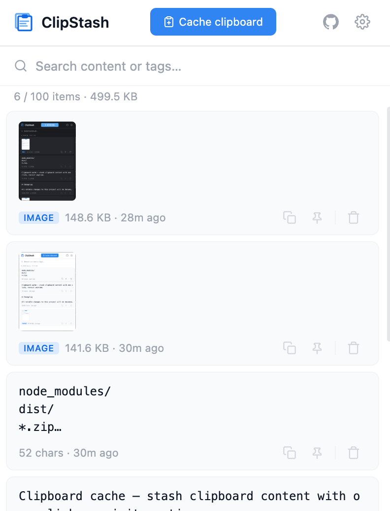

# ClipStash

  

  <strong>Clipboard cache — stash clipboard content with one click, revisit anytime.</strong>

  <a href="README.zh-CN.md">中文</a> | English

  

---

This repository contains two implementations of ClipStash:

| Project | Description | Tech Stack |
|---------|-------------|------------|
| [**clipstash-ext**](clipstash-ext/) | Chrome browser extension | Manifest V3, Vanilla JS, chrome.storage.local |
| [**clipstash-desktop**](clipstash-desktop/) | Cross-platform desktop app | Tauri 2.x, Rust, Vanilla JS, SQLite |

The two projects are **independent** in terms of code and runtime — each can be developed, built, and used on its own. The only cross-project dependency is that `clipstash-desktop` reads the icon source from `clipstash-ext/icons/icon128.png` when generating app icons (build-time only).

### Browser Extension

### Desktop App

## Quick Links

- **Extension** — [README](clipstash-ext/README.md) · [CHANGELOG](clipstash-ext/CHANGELOG.md)
- **Desktop** — [README](clipstash-desktop/README.md) · [CHANGELOG](clipstash-desktop/CHANGELOG.md)

## License

[MIT](LICENSE) © [lonsty](https://github.com/lonsty)
