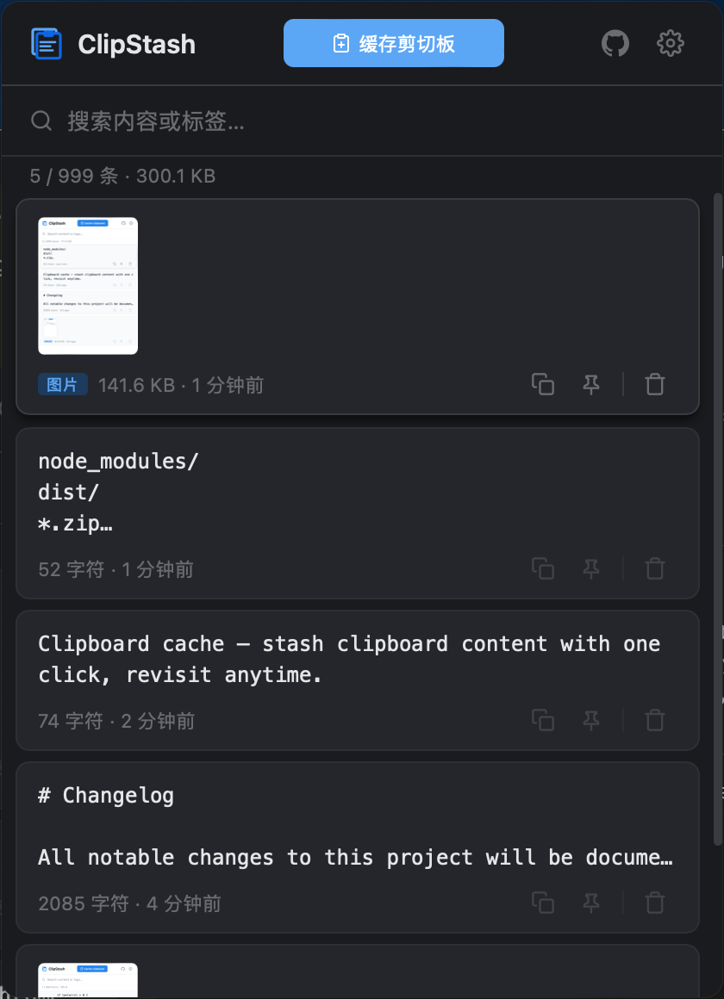

# ClipStash

  

  <strong>剪切板缓存 — 一键暂存剪切板内容，随时回溯复用。</strong>

  中文 | <a href="README.md">English</a>

  

---

本仓库包含 ClipStash 的两个实现：

| 项目 | 说明 | 技术栈 |
|------|------|--------|
| [**clipstash-ext**](clipstash-ext/) | Chrome 浏览器扩展 | Manifest V3, Vanilla JS, chrome.storage.local |
| [**clipstash-desktop**](clipstash-desktop/) | 跨平台桌面客户端 | Tauri 2.x, Rust, Vanilla JS, SQLite |

两个项目在代码和运行时上**相互独立**，可以单独开发、构建和使用。它们共享一个 `shared/` 模块目录（常量、国际化翻译、图标、DOM 工具函数、加密），Extension 通过符号链接引用，Desktop 通过 `sync-shared.sh` 同步。通过 GitHub Gist 云同步功能（始终加密）可实现跨设备数据共享。

### 浏览器扩展

### 桌面应用

## 快速链接

- **扩展** — [README](clipstash-ext/README.zh-CN.md) · [CHANGELOG](clipstash-ext/CHANGELOG.zh-CN.md)
- **桌面** — [README](clipstash-desktop/README.zh-CN.md) · [CHANGELOG](clipstash-desktop/CHANGELOG.zh-CN.md)

## 许可

[MIT](LICENSE) © [lonsty](https://github.com/lonsty)
