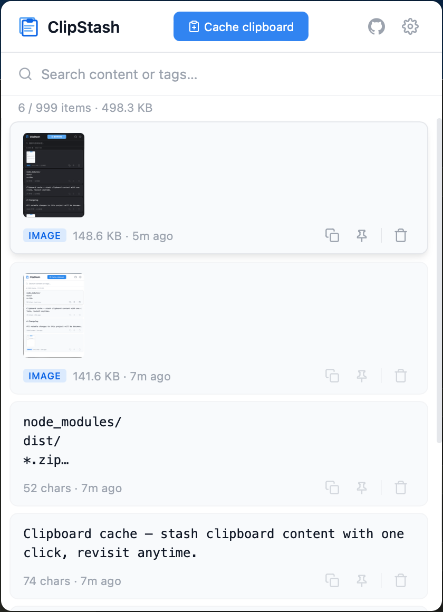

# ClipStash Desktop

<p align="center">
  
</p>

<p align="center">
  <strong>Cross-platform clipboard cache manager</strong><br>
  Cache clipboard content with one click and revisit anytime.
</p>

<p align="center">
  <a href="README.zh-CN.md">中文</a> | English
</p>

<p align="center">
  <a href="https://github.com/lonsty/clipstash/releases"></a>
  <a href="LICENSE"></a>
  
</p>

---

## Features

- **Clipboard caching** — text, images (PNG / JPEG), and HTML rich text
- **Deduplication** — SHA-256 hash for images, exact match for text
- **System tray** — lives in the menu bar / taskbar; popover-style window
- **Global hotkey** — `Alt+Shift+C` (customizable) to cache clipboard instantly
- **Clipboard monitoring** — optional auto-cache on clipboard change
- **Search & tags** — real-time search, tagging, pinning
- **Inline editing** — edit content in detail modal with syntax highlighting, floating toolbar, and unsaved change protection
- **Fullscreen & sticky note** — view content fullscreen or pin as always-on-top floating note
- **Import / export** — JSON-based data portability
- **Themes** — System / Light / Dark with full CSS variable system
- **i18n** — English & 中文
- **Privacy first** — all data stored locally in SQLite, zero network requests

## Screenshot



## Installation

### macOS

1. Download `ClipStash_x.x.x_aarch64.dmg` (Apple Silicon) or `ClipStash_x.x.x_x64.dmg` (Intel) from [Releases](https://github.com/lonsty/clipstash/releases).
2. Open the `.dmg` file and drag **ClipStash** to the **Applications** folder.
3. If macOS shows **"ClipStash is damaged and can't be opened"**, run the following command in Terminal:
   ```bash
   xattr -cr /Applications/ClipStash.app
   ```
   This is expected for unsigned builds. Alternatively, go to **System Settings → Privacy & Security** and click **Open Anyway**.

### Windows

1. Download `ClipStash_x.x.x_x64-setup.exe` from [Releases](https://github.com/lonsty/clipstash/releases).
2. Run the installer and follow the prompts.
3. Windows 10+ with WebView2 is required (pre-installed on most systems).

### Linux

1. Download `ClipStash_x.x.x_amd64.deb` (Debian / Ubuntu) or `ClipStash_x.x.x_amd64.AppImage` (universal) from [Releases](https://github.com/lonsty/clipstash/releases).
2. For `.deb`:
   ```bash
   sudo dpkg -i ClipStash_x.x.x_amd64.deb
   ```
3. For `.AppImage`:
   ```bash
   chmod +x ClipStash_x.x.x_amd64.AppImage
   ./ClipStash_x.x.x_amd64.AppImage
   ```
4. Requires `libwebkit2gtk-4.1` and `libgtk-3`.

## Usage

| Action | How |
|--------|-----|
| Open / hide window | Click the tray icon (left-click) |
| Cache clipboard | Click **Cache clipboard** button, press `Alt+Shift+C`, or use tray menu |
| Search | `Ctrl/Cmd+F` or click search bar |
| Copy a cached item | Click the copy button on any card |
| Pin / unpin | Click the pin button on any card |
| View full content | Click on a card's content area |
| Edit content | Open detail modal → click edit button in floating toolbar |
| Fullscreen view | Open detail modal → click fullscreen button |
| Sticky note | Open detail modal → click sticky note button |
| Add tags | Open detail modal → click `+` button in tag area |
| Settings | Click the gear icon or tray menu → **Settings...** |
| Quit | Tray menu → **Quit** |

> The window auto-hides when it loses focus (popover behavior).

## Build from Source

### Prerequisites

- [Node.js](https://nodejs.org/) ≥ 18
- [Rust](https://www.rust-lang.org/tools/install) ≥ 1.77
- Platform-specific dependencies:
  - **macOS**: Xcode Command Line Tools (`xcode-select --install`)
  - **Windows**: [Microsoft C++ Build Tools](https://visualstudio.microsoft.com/visual-cpp-build-tools/), WebView2
  - **Linux**: `build-essential`, `libwebkit2gtk-4.1-dev`, `libgtk-3-dev`, `libayatana-appindicator3-dev`, `librsvg2-dev`

### Steps

```bash
git clone https://github.com/lonsty/clipstash.git
cd clipstash/clipstash-desktop

# Install Node dependencies
npm install

# Development mode (with hot-reload)
npx tauri dev

# Production build
npx tauri build
```

### Build Artifacts

| Platform | Path |
|----------|------|
| macOS | `src-tauri/target/release/bundle/macos/ClipStash.app` |
| macOS DMG | `src-tauri/target/release/bundle/dmg/ClipStash_*.dmg` |
| Windows | `src-tauri/target/release/bundle/nsis/ClipStash_*-setup.exe` |
| Linux DEB | `src-tauri/target/release/bundle/deb/ClipStash_*.deb` |
| Linux AppImage | `src-tauri/target/release/bundle/appimage/ClipStash_*.AppImage` |

## Tech Stack

| Component | Technology |
|-----------|------------|
| Framework | [Tauri 2.x](https://v2.tauri.app/) |
| Backend | Rust |
| Frontend | Vanilla JS (ES Modules) + HTML + CSS |
| Database | SQLite (via `rusqlite`, WAL mode) |
| Clipboard | `arboard` (with image support) |
| Icons | Inline SVG + PNG app icon |

## Project Structure

```
clipstash-desktop/
├── src-tauri/                     # Backend (Rust)
│   ├── Cargo.toml
│   ├── tauri.conf.json
│   ├── capabilities/              # Window permissions
│   ├── icons/                     # App icons
│   └── src/
│       ├── main.rs                # Entry point
│       ├── lib.rs                 # App setup & plugin registration
│       ├── tray.rs                # System tray management
│       ├── clipboard.rs           # Clipboard read / write
│       ├── commands.rs            # Tauri commands (22)
│       ├── db.rs                  # SQLite database layer (WAL)
│       ├── hotkey.rs              # Global shortcut registration
│       └── monitor.rs             # Clipboard auto-monitoring (500ms)
├── src/                           # Frontend (Vanilla JS)
│   ├── index.html                 # Main page
│   ├── fullscreen.html            # Fullscreen view page
│   ├── icons/
│   │   └── icon128.png            # App icon (header)
│   ├── styles/
│   │   ├── main.css               # Main styles (Light / Dark / System)
│   │   └── fullscreen.css         # Fullscreen view styles
│   ├── scripts/
│   │   ├── main.js                # Main logic
│   │   └── fullscreen.js          # Fullscreen view logic
│   └── utils/
│       ├── bridge.js              # Tauri invoke wrapper
│       ├── i18n.js                # i18n (EN / 中文, 80+ keys)
│       ├── storage.js             # Storage abstraction
│       └── time.js                # Relative time formatting
├── package.json
├── CHANGELOG.md
├── LICENSE
└── README.md
```

## Related

- [ClipStash Extension](../clipstash-ext/) — Chrome browser extension (the original version)

> **Note**: The desktop app icon is generated from `clipstash-ext/icons/icon128.png`. Run `node scripts/generate-icons.js` after updating the source icon.

## License

[MIT](LICENSE) © [lonsty](https://github.com/lonsty)
