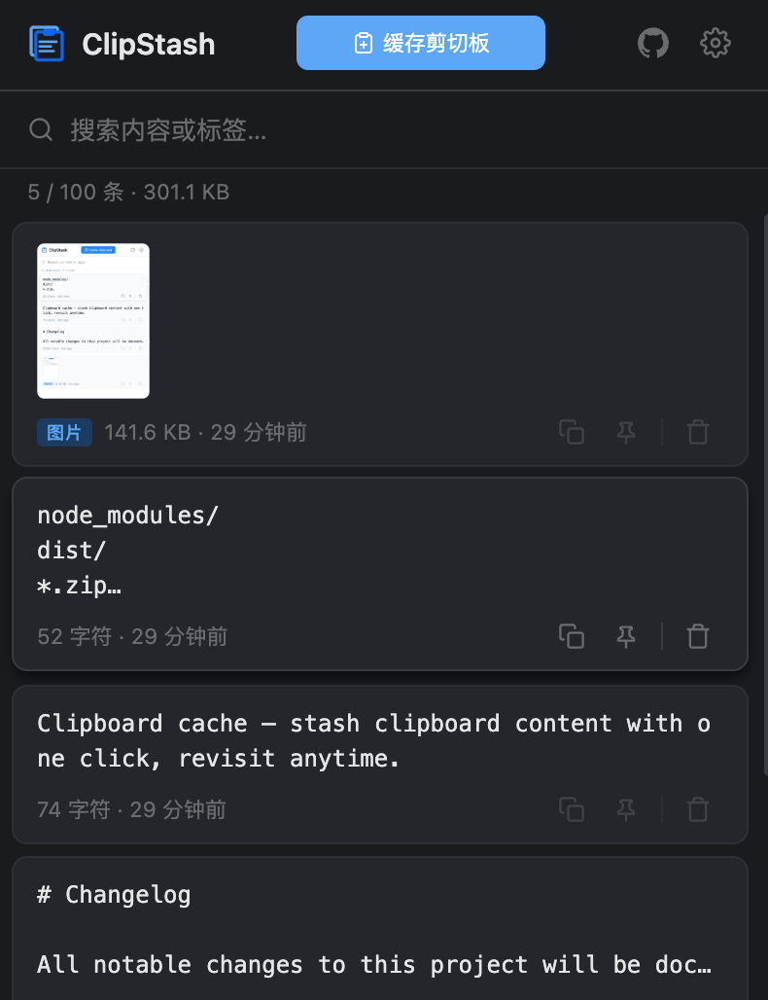

# ClipStash Extension

<p align="center">
  
</p>

<p align="center">
  <strong>Chrome 剪切板缓存扩展</strong><br>
  一键暂存剪切板内容，随时回溯复用。
</p>

<p align="center">
  中文 | <a href="README.md">English</a>
</p>

<p align="center">
  <a href="https://github.com/lonsty/clipstash/releases"></a>
  <a href="LICENSE"></a>
  
</p>

---

## 截图



## 功能

| 功能 | 说明 |
|------|------|
| 剪切板缓存 | 点击缓存剪切板内容，支持文本、图片、HTML 富文本 |
| 快捷复制 | 一键复制，显示"已复制 ✓"反馈 |
| 内联编辑 | 浮动工具栏直接编辑文本内容，离开前确认未保存变更 |
| 全屏查看 | 新标签页全屏展示，支持编辑和语法高亮 |
| 语法高亮 | 代码块高亮渲染，支持 30 种语言 |
| 标签系统 | 为缓存添加标签，重复检测 + 抖动动画提示 |
| 搜索过滤 | 实时搜索，快捷键 Ctrl/Cmd+F 聚焦 |
| 置顶收藏 | 常用记录置顶显示 |
| 导出导入 | JSON 格式，导入自动去重 |
| 暗色主题 | 跟随系统 / 浅色 / 深色，即时切换 |
| 国际化 | 中英双语，即时切换 |
| 快捷键 | 默认 `Alt+Shift+C`，可在 `chrome://extensions/shortcuts` 自定义 |
| 缓存上限 | 可配置 10 ~ 999 条 |

## 安装

### 从 GitHub Release 安装

1. 前往 [Releases](https://github.com/lonsty/clipstash/releases) 下载最新的 `clipstash-*.zip`。
2. 解压到任意目录。
3. 打开 Chrome，访问 `chrome://extensions/`。
4. 开启右上角 **开发者模式**。
5. 点击 **加载已解压的扩展程序**，选择解压后的目录。

### 从源码构建

```bash
git clone https://github.com/lonsty/clipstash.git
cd clipstash/clipstash-ext
npm install
npm run build
```

然后按上述步骤 3-5 加载 `dist/` 目录即可。

## 使用

| 操作 | 方式 |
|------|------|
| 打开面板 | 点击扩展图标 |
| 缓存剪切板 | 点击按钮或快捷键 `Alt+Shift+C` |
| 搜索 | `Ctrl/Cmd+F` 或点击搜索栏 |
| 复制缓存 | 点击卡片上的复制按钮 |
| 置顶 | 点击卡片上的置顶按钮 |
| 添加标签 | 打开详情弹窗 → 添加标签 |
| 查看全文 | 点击卡片内容区域 |
| 设置 | 点击 Popup 中的设置区域 |

## 本地开发

```bash
# 生成图标
npm run icons

# 构建到 dist/
npm run build

# 构建并打包 zip
npm run zip

# 清理构建产物
npm run clean
```

### 调试

- **Popup 页面**：右键插件图标 → 审查弹出内容
- **Service Worker**：`chrome://extensions/` → ClipStash 卡片 → 点击「Service Worker」链接

## 技术栈

| 组件 | 技术 |
|------|------|
| 平台 | Chrome Manifest V3 |
| 前端 | Vanilla JS (ES Modules) + HTML + CSS |
| 存储 | `chrome.storage.local` |
| 剪切板 | `navigator.clipboard` API |
| 依赖 | 零运行时依赖 |

## 项目结构

```
clipstash-ext/
├── manifest.json              # 扩展清单（Manifest V3）
├── popup/
│   ├── popup.html             # 弹出页面
│   ├── popup.css              # 样式
│   └── popup.js               # 交互逻辑
├── background/
│   └── service-worker.js      # Service Worker
├── offscreen/
│   ├── offscreen.html         # 离屏文档
│   └── offscreen.js           # 剪切板读取
├── fullscreen/
│   ├── fullscreen.html        # 全屏页面（新标签页）
│   ├── fullscreen.css         # 全屏样式
│   └── fullscreen.js          # 全屏逻辑
├── utils/
│   ├── storage.js             # 存储封装
│   ├── clipboard.js           # 剪切板封装
│   ├── time.js                # 相对时间
│   ├── i18n.js                # 国际化
│   └── constants.js           # 共享常量
├── vendor/
│   ├── highlight.min.js       # 语法高亮引擎
│   ├── hljs-light.css         # 浅色高亮主题
│   └── hljs-dark.css          # 深色高亮主题
├── icons/                     # 图标（16/48/128px）
├── scripts/
│   ├── build.js               # 构建脚本
│   └── generate-icons.js      # 图标生成
└── dist/                      # 构建输出
```

## 隐私

- 不收集任何用户数据
- 不进行任何网络请求
- 所有数据仅存储在本地（`chrome.storage.local`）

## 相关项目

- [ClipStash Desktop](../clipstash-desktop/) — 跨平台桌面客户端（Tauri 2.x）

## 许可

[MIT](LICENSE) © [lonsty](https://github.com/lonsty)
